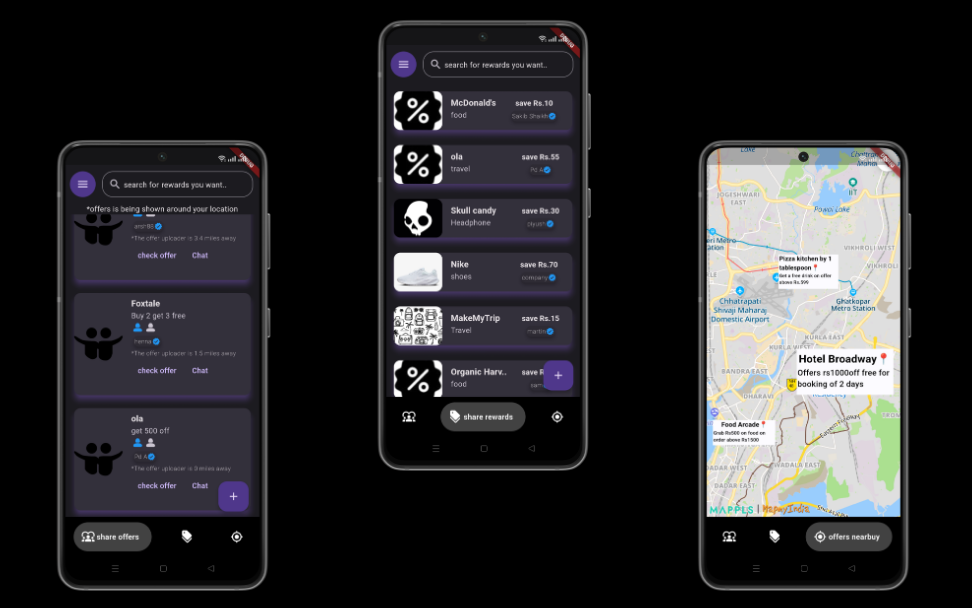

Offerzhub

An application that provides a whole new way of grabbing offers around the world. Its features include:
OffersShare:
The first-in-the-world feature that connects people around the globe who are willing to share the same offer to save money. For example, on a ‘Buy 2, get $20 off’ deal, two people living in the same locality can collaborate here.
RewardShare:
Most reward coupons go to waste. This feature allows users to buy and sell rewards at their preferred prices. It fosters a collaborative marketplace for rewards.
NearbyOffers:
This feature helps customers get the best deals from thousands of shops nearby. There is no sophisticated tool available that shows ongoing offers on items like clothes, accessories, restaurants, and more. This feature ensures that customers get the best value for their purchases.

